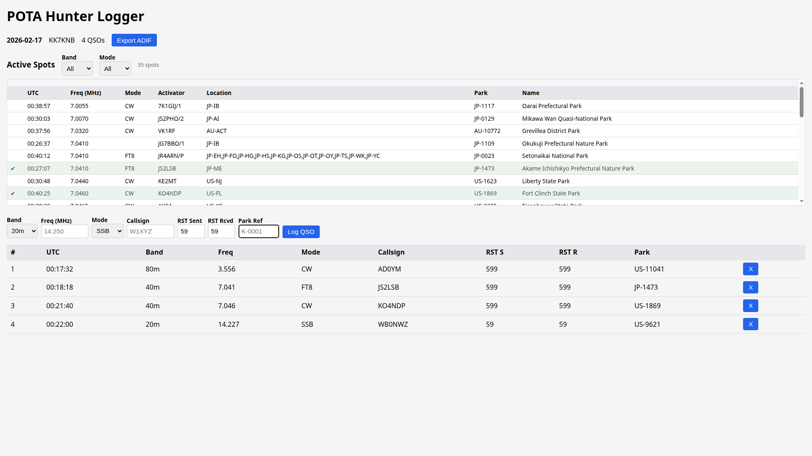

# POTA Hunter Logger

[](https://github.com/stevenmburns/claude-pota-logger/actions/workflows/backend-tests.yml)

A Parks on the Air (POTA) **hunter** logging application for logging contacts with park activators from home. Built with a FastAPI backend, PostgreSQL database, and React frontend.



## Features

- **Active Spots Browser** — real-time feed of active POTA activators (columns: Hunted, UTC, Freq, Mode, Activator, Location, Park, Name) sorted by freq/activator/time with server-side band/mode filtering; click a spot row to auto-fill the QSO form and focus RST Sent; click the Freq cell to also tune the radio via flrig; spots already worked today are marked with a checkmark and green background; list refreshes immediately after logging or deleting a QSO
- **flrig Frequency Control** — clicking a spot's frequency cell sends the frequency to flrig via XML-RPC; flrig host/port configurable in Settings (defaults: `localhost:12345`)
- **QSO Logging** — log contacts with fields: Band, Freq, Mode, Callsign, RST Sent, RST Rcvd, Park Ref (auto-detects band from frequency); QSO table columns: #, UTC, Band, Freq, Mode, Callsign, RST S, RST R, Park
- **Park Lookup** — debounced lookup against the POTA API shows park names as you type
- **Duplicate Prevention** — unique constraint on callsign + park + band per session (409 on duplicates)
- **ADIF Export** — download contacts in ADIF v3.1.4 hunter format (`SIG=POTA`, `SIG_INFO` per QSO)
- **Daily Sessions** — one hunt session per day, auto-created on first visit

## Prerequisites

- Docker and Docker Compose
- Node.js 20+ (via nvm: `nvm use 20`)

## Quick Start

```bash
# Start backend + database
docker compose up -d

# Start frontend
cd frontend && npm run dev
```

- Frontend: http://localhost:5173
- Backend API: http://localhost:8000

On first visit, you'll be prompted to enter your operator callsign.

## Development

```bash
# Rebuild backend after code changes
docker compose up -d --build

# Stop everything
docker compose down

# Reset database (drops all data)
docker compose down
docker volume rm claude-pota-logger_pgdata
docker compose up -d --build
```

## Testing

```bash
# Install test dependencies (one-time)
cd backend
python -m venv .venv && source .venv/bin/activate
pip install -r requirements-test.txt

# Run tests (88 tests, ~2s, no Docker needed)
pytest -v
```

Tests use in-memory SQLite — no running database required. External POTA API calls are mocked.

## Architecture

| Layer | Technology | Runs in |
|-------|-----------|---------|
| Backend | FastAPI (Python 3.12), async SQLAlchemy + asyncpg | Docker |
| Database | PostgreSQL 16 | Docker |
| Frontend | React + TypeScript + Vite | Local (npm) |

## API Endpoints

| Method | Path | Description |
|--------|------|-------------|
| GET | `/api/hunt-sessions/today` | Auto-create or return today's session |
| GET | `/api/hunt-sessions` | List all sessions |
| GET | `/api/hunt-sessions/{id}` | Get session with QSOs |
| POST | `/api/hunt-sessions/{id}/qsos` | Log a QSO |
| GET | `/api/hunt-sessions/{id}/qsos` | List QSOs |
| DELETE | `/api/hunt-sessions/{id}/qsos/{qso_id}` | Delete a QSO |
| GET | `/api/hunt-sessions/{id}/export` | Download ADIF file |
| GET | `/api/settings` | Get operator settings |
| PUT | `/api/settings` | Update operator callsign, flrig host/port |
| GET | `/api/parks/{park_ref}` | Park name/location lookup |
| GET | `/api/spots` | Active POTA activator spots (optional `band`, `mode` query params); includes `hunted` flag |
| POST | `/api/radio/set-frequency` | Set radio frequency via flrig XML-RPC; body: `{ frequency_khz: number }` |
